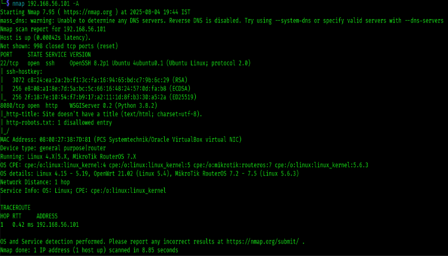
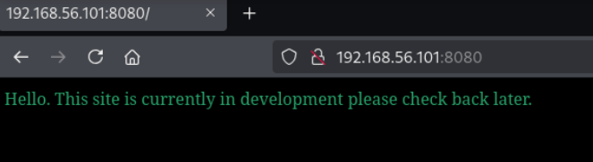

## Write-Up on Mercury from VulnHub

### Setup
1. **Download Mercury**: Obtain the **Mercury.ova** file from VulnHub.
2. **Run in a Virtual Environment**: Launch the downloaded **Mercury.ova** file in a virtual environment, such as **VirtualBox**.
3. **Access the Login Screen**: Once **Mercury.ova** is booted, you will arrive at the login screen. Since we do not have the login credentials, our next step will be to identify and exploit any vulnerabilities present.

---

### Reconnaissance
To begin our reconnaissance, we need to identify the IP address of the Mercury machine. We can do this using the command:

```bash
sudo netdiscover
```


**Netdiscover** is a network reconnaissance tool used primarily for discovering live hosts on a local network. In this case, we find that the target machine is **192.168.56.101**.

Next, we will look for any open ports on the target machine using **Nmap**:

```bash
nmap 192.168.56.101 -A
```


**Nmap** is used to scan for ports on target machines; here, the **-A** option is used for aggressive scanning. The scan reveals that the TCP port is open with an **SSH** service.

Now, let's try connecting to the target service using **192.168.56.101:8080** in the browser. We will check if we can access any other directories.


Upon accessing the site, we discover three directories. Let's explore **192.168.56.101:8080/mercuryfacts/**, which leads us to two sub-directories: **mercury-facts** and **to-do-list**. The **to-do-list** does not have any exploits, so we will focus on **mercury-facts**.


### SQL Injection Vulnerability
The **mercury-facts** page appears to be vulnerable to **SQL injection** attacks. SQL injection is a code injection technique that allows attackers to execute malicious SQL statements, potentially compromising sensitive data. We will use **sqlmap** to exploit this vulnerability:

```bash
sqlmap -u http://192.168.56.101:8080/mercuryfacts/1 --dump-all
```


This command will dump all the databases on the target server. We are particularly interested in the database containing usernames and passwords.


After running the command, we find the following credentials:
- **Username**: webmaster
- **Password**: mercuryisthesizeof0.056Earths

Now, let's attempt to log in using these credentials.


---

### User Access and Privilege Escalation
After logging in, we explore the target machine and find the user flag. Further investigation reveals another user named **linuxmaster**. The password for this user is encoded in **base64**. We can decode it using the following command:

```bash
echo "base64_encoded_string" | base64 -d
```


The decoded password is **mercurymeandiameteris4880km**. 

Next, we log in as **linuxmaster**. Running the `ls` command shows no files or directories. To check for commands we can run with root privileges, we execute:


```bash
sudo -l
```


This reveals that **/usr/bin/check_syslog.sh** can be run as root. The script only shows the last 10 lines of the system log.

### Privilege Escalation Process
To escalate privileges, we create a text file named **tail** that contains a command to copy **/bin/bash** to **/tmp/rootbash** and set it with **SUID** permissions. This allows it to be executed with root privileges because, at the time the permissions are set (i.e., SUID), the user has root privileges. If we attempt to set permissions for any other program while the file-creating user lacks root privileges, it will not work.

After writing the source file, we set **tail** to be executable for the user **linuxmaster**. The **tail** command already exists in Linux and is used in the script. Whenever a command is executed in Linux, it checks sequentially in **/bin/bash**. To ensure our executable file is used instead of the original **tail** command, we modify the **PATH** environment variable to prioritize our current directory:

```bash
export PATH=.:$PATH
```

Now, we run the command:

```bash
sudo --preserve-env=PATH /usr/bin/check_syslog.sh
```

This executes our **tail** file instead of the original command. We were able to do this because executing **/usr/bin/check_syslog.sh** was set in a virtual environment.

Finally, we run our **rootbash** executable with:

```bash
/tmp/rootbash -p
```


The -p option starts a new shell with root user privileges. We can now access the root directory and find the root flag.

### Conclusion

This write-up outlines the steps taken to exploit vulnerabilities in the Mercury machine from VulnHub. The process involved reconnaissance, identifying SQL injection vulnerabilities, and escalating privileges to gain root access. Understanding these techniques is crucial for penetration testing and improving security measures against such attacks.

For further reading on SQL injection and privilege escalation techniques, consider exploring resources from OWASP and other cybersecurity training platforms.
